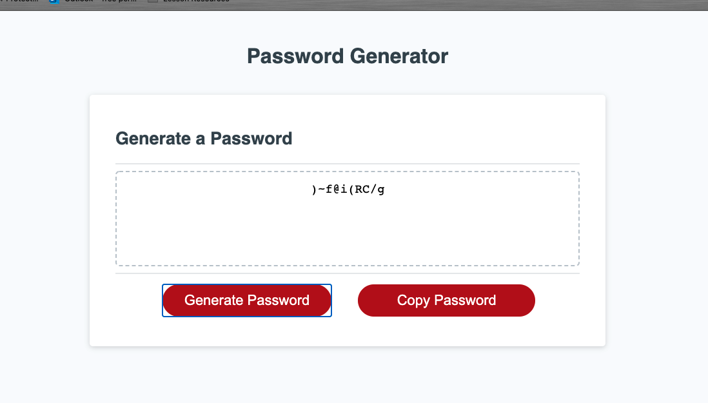

# Password Generator

## Purpose
Add javascript to give functionality to elements in index.html for generating random passwrods with certain inputs

## Built With
* Javascript
* HTML
* CSS

## Git Hub Repository
https://github.com/nnikhil84/generate.passwords.github.io

## Deployed Website
https://nnikhil84.github.io/generate.passwords.github.io/

## Task Achieved
* Downloaded the starter code from the remote repository
* Initiated the git in the local repository 
* Created README.md
* Created develop and feature/add-copy-button branches 
* While in feature/add-copy-button branch, updated index.html and style.css to include another button to copy password that will be generated
* prepared pseudo code wireframe as per below image to write javascript code in feature/pseudo-code branch

* Wrote javascript to provide functionality to Generate Password button
* Given functionality to Copy Password button 

## Resources Used
* https://www.w3schools.com/js/js_variables.asp
* https://www.w3schools.com/js/js_strings.asp
* https://developer.mozilla.org/en-US/docs/Mozilla/Add-ons/WebExtensions/Interact_with_the_clipboard
* https://developer.mozilla.org/en-US/docs/Web/JavaScript/Guide/Functions
* https://developer.mozilla.org/en-US/docs/Web/JavaScript/Guide/Loops_and_iteration

## Screenshot of completed web application

